# KapibalaAI Lead Qualification Agent

A minimal, auditable lead-qualification agent: Gemini interprets customer
messages, while deterministic Python code owns every state transition and side
effect.

> Core rule: model output is an untrusted **proposal**. Only the state machine's
> `effective_action` can reach the executor.

## What is implemented

- Real Gemini intent classification for five intents plus the independent
  `is_dissatisfied` signal.
- A closed set of four actions: `reply`, `schedule_followup`,
  `escalate_to_human`, and `mark_not_interested`.
- A deterministic takeover state machine, per-customer rolling 60-second send
  limit, optimistic concurrency control, and token-protected reactivation.
- A separate structured reply-review call before any generated reply can be
  sent.
- FastAPI endpoints, a framework-free browser demo, SQLite persistence, and a
  simulated outbound channel.
- 91 deterministic tests, five live adversarial scenarios, and an eight-process
  concurrency probe.

The latest recorded run passed all five live scenarios with 7 analysis calls,
5 reply-review calls, and no model-call failures. The process probe converged to
exactly 1 `sent` and 7 `rate_limited` results. See the
[sanitized execution evidence](evidence/phase7-adversarial-results.md).

## Run from zero

Requirements: Python 3.11+ and, for Gemini-backed message handling, a valid
Gemini API key.

```bash
git clone https://github.com/Regan-Lu/kapibala-lead-qualification-agent.git
cd kapibala-lead-qualification-agent

python3 -m venv .venv
source .venv/bin/activate
python -m pip install -e '.[dev]'

cp .env.example .env
# Fill GEMINI_API_KEY and OPERATOR_TOKEN in the ignored local .env.
set -a
source .env
set +a

python -m uvicorn lead_qualification_agent.app:app --reload
```

Open <http://127.0.0.1:8000/>. The health check is available at
<http://127.0.0.1:8000/health> and should return:

```json
{"status":"ok"}
```

The server and UI still start without `GEMINI_API_KEY`; health checks and
stored-session reads remain available, while a message for a new or existing
active conversation returns a generic 503. The Gemini key stays server-side
and `.env` is ignored.

## Architecture

```mermaid
flowchart LR
    Customer["Customer / browser"] --> API["FastAPI customer API"]
    API --> Service["ConversationService"]
    Service -->|load persisted session| DB["SQLite transaction<br/>revision check"]
    Service -->|active session| Guard["GuardedAnalysisService"]
    Guard --> Analysis["Gemini analysis<br/>tool-free structured output"]
    Analysis --> Contract["Pydantic AnalysisResult"]
    Contract -->|reply proposal only| Review["Gemini reply review<br/>separate instruction"]
    Review --> ReviewContract["Pydantic ReplyReview"]
    ReviewContract -->|guard accepts or clears draft| PolicyResult["Policy-ready AnalysisResult"]
    Review -->|failure fallback| PolicyResult
    Contract -->|non-reply proposal| PolicyResult
    Guard -->|analysis failure fallback| PolicyResult
    PolicyResult --> Policy["Deterministic state machine"]
    Service -->|inactive: skip model| Policy
    Service -->|operator reactivation| Policy
    Policy --> Approved["StateTransition<br/>effective_action"]
    Approved --> Executor["ActionExecutor<br/>closed dispatch"]
    Executor -->|non-reply state and event| DB
    Executor -->|reply| Gateway["OutboundGateway"]
    Gateway -->|1. prepare_reply| DB
    DB -->|2. reservation result| Gateway
    Gateway -->|3. reserved only| Sender["Simulated outbound sender"]
    Sender -->|4. delivery result| Gateway
    Gateway -->|5. finalize_outbound| DB
    Operator["Operator API<br/>header token"] -->|reactivate| Service
    Operator -->|demo reset| DB
```



The model has no tools. Customer text is placed in the untrusted input field,
not interpolated into the system instruction. The active path obtains a locally
validated analysis result, reviews reply drafts, asks the pure state machine
for a transition, and executes only that transition. For `human_takeover` or
closed sessions, it returns a silent transition before calling Gemini.

## Hard constraints: code, mechanism, proof

| Requirement | Code-level enforcement | Tests and execution evidence |
| --- | --- | --- |
| At most one outbound message in any rolling 60-second window per customer | [`SQLiteSessionStore.prepare_reply`](src/lead_qualification_agent/adapters/sqlite.py#L564-L669) runs inside `BEGIN IMMEDIATE` and conditionally updates `last_sent_at` only when `now - last_sent_at >= 60`. [`OutboundGateway.send`](src/lead_qualification_agent/application/executor.py#L80-L155) reserves before calling the sender. This is elapsed-time logic, not a fixed minute bucket. | [`test_rolling_window_uses_0_59_9_and_60_second_boundaries`](tests/test_actions.py#L99) covers 0/59.9/60.0 seconds. [`test_spawned_workers_share_one_reply_slot`](tests/test_concurrency.py#L106) uses 8 spawned processes and independent connections; the standalone [`run_concurrency_probe.py`](scripts/run_concurrency_probe.py) reloads stale state and reproduces 1 `sent` / 7 `rate_limited`. |
| Two consecutive off-topic or dissatisfied turns force takeover; a validated non-issue turn resets the shared streak | [`handle_analysis`](src/lead_qualification_agent/domain/state_machine.py#L94-L185) computes one shared issue signal, increments at most once per turn, resets on a validated non-issue result, and gives the threshold priority over every model proposal. [`ConversationService`](src/lead_qualification_agent/application/conversation_service.py#L68-L123) skips Gemini entirely once the session is inactive. | [`test_state_machine.py`](tests/test_state_machine.py) covers shared counting, reset, precedence, and silence. [`test_two_consecutive_issue_turns_force_takeover_at_the_api_boundary`](tests/test_api.py#L258) proves the API path. Live scenarios 3–4 reproduce takeover and customer-side bypass failure. |
| Customer text cannot introduce a fifth action or bypass takeover | [`Action` and `AnalysisResult`](src/lead_qualification_agent/domain/models.py#L15-L70) form a closed contract that forbids extra fields. The customer DTO accepts only `message`; the model proposal goes through `effective_action`; [`ActionExecutor`](src/lead_qualification_agent/application/executor.py#L158-L376) explicitly dispatches the four actions and blocks actions from non-active state. Reactivation exists only behind the operator route. | [`test_unknown_intent_or_action_is_rejected`](tests/test_analysis_contract.py#L101), [`test_non_active_state_cannot_be_bypassed_by_fabricated_reply_transition`](tests/test_actions.py#L217), and [`test_message_request_rejects_client_supplied_control_fields`](tests/test_api.py#L300). Live scenarios 1 and 4 attack both boundaries. |
| Customer-visible text should not disclose system instructions or private business information | [`gemini.py`](src/lead_qualification_agent/adapters/gemini.py#L32-L70) uses a deliberately small public context and separate analysis/review instructions; [`GeminiInteractionClient.generate_json`](src/lead_qualification_agent/adapters/gemini.py#L125-L143) declares no tools and keeps system instruction separate from untrusted input. Local Pydantic validation happens in [`GeminiAnalyzer`](src/lead_qualification_agent/adapters/gemini.py#L202-L237). [`GuardedAnalysisService`](src/lead_qualification_agent/application/analysis_service.py) clears a blocked draft and proposes escalation; the state machine and executor then enter silent takeover. Public API DTOs omit prompts, notes, raw model output, and unsent drafts. | [`test_analyzer_keeps_customer_text_out_of_system_instruction`](tests/test_gemini_adapter.py#L52), [`test_blocked_reply_is_cleared_and_escalated`](tests/test_analysis_service.py#L79), and API response-boundary tests. Live scenario 2 produced no customer-visible text. This is layered risk reduction, **not** a claim of perfect semantic prompt-injection defense. |

The second constraint guarantees deterministic counting and override after the
LLM supplies validated signals; the model still decides whether a message is
off-topic or clearly dissatisfied. An analysis-stage failure becomes a
non-issue, silent `schedule_followup` and resets the streak. A reply-review
failure suppresses the draft but preserves the already validated intent and
dissatisfaction signal, so it can still contribute to forced takeover.

## API and demo

| Method | Path | Purpose |
| --- | --- | --- |
| `GET` | `/` | Browser chat and constraint inspector |
| `GET` | `/health` | Process health; no model key required |
| `POST` | `/conversations/{customer_id}/messages` | Complete customer-message path |
| `GET` | `/conversations/{customer_id}` | Persisted state and recent action outcomes |
| `POST` | `/operator/conversations/{customer_id}/reactivate` | Reactivate `human_takeover` with `X-Operator-Token` |
| `POST` | `/operator/demo/reset` | Clear demo state with `X-Operator-Token` |

Minimal API example:

```bash
curl -sS -X POST http://127.0.0.1:8000/conversations/demo-001/messages \
  -H 'Content-Type: application/json' \
  --data '{"message":"What can your lead-qualification product do?"}'
```

The browser demo includes editable shortcuts for a normal question, prompt
injection, internal-information extraction, dissatisfied turns, and takeover
bypass. Shortcuts fill the composer but do not auto-send. The UI renders an
Agent bubble only when the server reports both `message_sent: true` and a
non-empty `reply`; limited, silent, stale, or failed drafts are never shown as
sent messages.

## Verification

No Gemini credential is needed for deterministic verification:

```bash
pytest -q
python scripts/run_concurrency_probe.py
```

With the ignored local `.env` loaded, reproduce the live model checks:

```bash
python scripts/live_gemini_smoke.py
python scripts/run_adversarial_scenarios.py
```

The adversarial runner records only public response fields and aggregate call
counts. It does not print generated replies, raw requests or responses,
internal notes, exception details, credentials, environment values, or local
paths. Hosted model choices can vary; deterministic tests are the proof of code
invariants, while the live run is execution evidence for the tested
conversations.

## Why this stack

- **Python + FastAPI + Pydantic:** fast to build, typed at external boundaries,
  and easy to test without hiding control flow.
- **Direct Gemini REST integration:** the task needs one structured analysis
  call and, only for a reply proposal, a second structured review—not a general
  agent runtime. Avoiding LangChain keeps prompt, schema, retry, and tool
  behavior visible and auditable.
- **SQLite:** sufficient for a local assessment and real same-host process
  contention. Each operation opens its own connection; writes use WAL,
  `BEGIN IMMEDIATE`, a state revision check, and one conditional slot update.
- **Vanilla browser UI:** no frontend build chain is needed to inspect state,
  events, and operator actions.

SQLite is not presented as a cross-machine production database. With Postgres,
the same invariant becomes one transaction using a row lock or an atomic
conditional `UPDATE ... RETURNING`, plus revision-based compare-and-set. Its
time predicate should use database-server time—for example,
`last_sent_at <= transaction_timestamp() - interval '60 seconds'`—rather than
unsynchronized worker clocks. Postgres then lets independent hosts coordinate
against one server while preserving the same policy boundary.

## Deliberate trade-offs and omitted scope

- Outbound delivery is simulated. Reserving before the sender favors duplicate
  suppression: a sender failure or crash consumes one window. It does not prove
  exactly-once delivery; a production integration needs an outbox, idempotency
  key, and provider reconciliation.
- Full conversation transcripts are not persisted or restored. The state
  machine is multi-turn, but the current Gemini call receives only the newest
  message from `ConversationService`.
- Analysis and reply review are separate calls with separate instructions and
  contracts, but use the same Gemini provider/model; they are not independent
  models.
- The application does not inject server-held credentials, private prices,
  contracts, or customer lists into model context. Separation, structured
  validation, and pre-send review add further risk reduction, but cannot
  guarantee that every semantic attack will be classified correctly.
- The customer-facing demo response exposes intent, action, status, streak,
  revision, and event outcomes for assessment observability. Production would
  split this operator detail from the customer response.
- The operator token and global reset are demo controls, not production-grade
  identity, authorization, tenant isolation, or audit policy.
- `schedule_followup` currently records an event; it is not a durable scheduler.
  Automatic retry, durable follow-up execution, real IM integration,
  deployment, and production observability were intentionally left out to keep
  the submission focused on the four required invariants.

## AI use, ownership, and actual time

This is a solo submission. Codex was used as a coding agent for requirement
decomposition, implementation drafts, tests, review, and documentation; it is
not a second candidate. I remained responsible for scope and acceptance, ran
the deterministic and live checks, inspected browser behavior, and retained
only results that could be reproduced. The first adversarial run exposed
ambiguous test wording and insufficient observability; the runner was revised
to count model-stage failures without retaining sensitive text, then rerun
successfully. Details are in [COLLAB.md](COLLAB.md).

Estimated active effort was approximately **12–15 hours across two calendar
days**. This is a retrospective range because no independent stopwatch was
running. The verifiable Git author-timestamp span from the first
commit (2026-09-01 23:26:05 +08:00) to the Phase 7 evidence commit
(2026-09-02 22:39:16 +08:00) is **23 hours 13 minutes**. That elapsed window
includes an overnight break, model waiting, browser acceptance, and
documentation; it is not claimed as 23 hours of continuous keyboard time.

For a compact presentation script, code navigation, likely questions, and
honest claim boundaries, see the
[Chinese defense guide](docs/DEFENSE_GUIDE.zh-CN.md).
